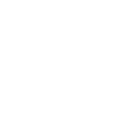

# td_streamdeck

**This is a setup for operating TouchDesigner with StreamDeck. For some functions that cannot be achieved with keyboard shortcuts, I use TouchDesigner's WebServer to call the URI corresponding to the Python function implemented in the WebServerOP via http from StreamDeck.　Both Stream Deck and TouchDesigner require configuration.**

## Stream Deck
**Please import the DeckProfile. You also need to install the API Ninja and Super Macro plugins. Please adjust the server address, port number, etc. according to your environment.**

## TouchDesigner
**Please use the tox file in this repository as is, or set it as the Custom Startup File by going to Preferences -> General -> Start Up File and changing it to "Custom File" and specifying the Custom Startup File.**

**If you need to modify or add functions, please add the URI and function name to the "switcher" dictionary in the Python script of the Web Server DAT OP (StreamdeckCommandReceiver), and add the function accordingly.**

| Icon        | Function           | Equivalente Shortcut  |
| :-------------: |:-------------| :-----:|
| | Default Pane Layout  | Call Python API (http) |
| | Pane Layout for Python Dev  | Call Python API (http) |
| | Pane Layout for 3D  | Call Python API (http) |
| | Create OPs for Rendering  | Call Python API (http) |
| | Next Page  | Stream Deck Function |
| | Parameter Show / Hide | P |
| | Perform Mode Enter  | F1 |
| | Open Current Op Viewer  | Shift + V |
| | Create null OP  | Call Python API (http) |
| | Delete Selection  | Backspace |
| | Play / Pause  | SPACE |
| | Home All  | H |
| | Bypass OP  | B |
| | Undo  | Ctrl + Z |
| | Create OP by Voice Typing  | Double Click, Win + H (Windows Only)  |
